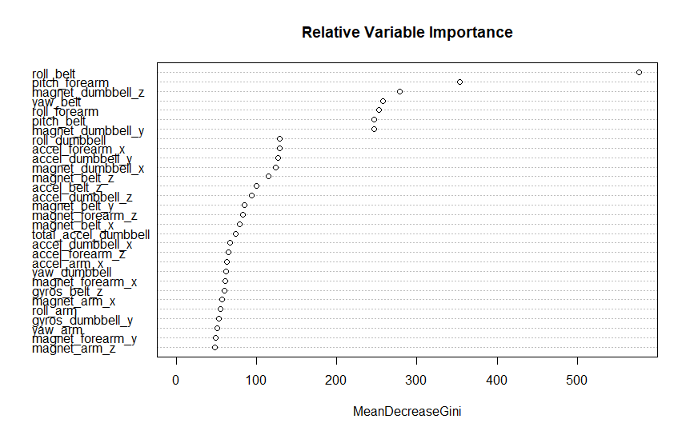

# Loading the Data
The first thing to be done is loading the data to R variables for analysis.
By default _read.csv_ assumes a csv header so there is no need to include that as an explicit parameter.


```
pmlTraining <- read.csv("~/RProjectWork/Project ML/pml-training.csv")
pmlTesting <- read.csv("~/RProjectWork/Project ML/pml-testing.csv")
dim(pmlTraining)
[1] 19622   160
[1]  20 160

```

There are 160 columns of data, however some observations to be made and some of the the data requires some preparation before use.

# Preparing the Data
## Removing specific non-sensor columns

There are a number of metadata columns which are not sensor data:

1. The first column _X_ is not a variable, but defines a row number.
2. The _user_name_ column in index 2 defines which of the 6 participants performed the exercise.
3. There are timestamp/time window data included in columns 3 to 7.

We will not be using the _user_name_ as a predictor since a more useful goal would be a generalised prediction not specific to user names.

In this case, it was decided not to use timestamp columms as variables for prediction since

1.  We do not want to treat this data as a series to to allow for non-sequential sampling. 
2.  From a conceptual point of view, because the exercises were performed in a supervised environment in the study and not based on choice of the participants, it could be assumed that the time of the exercise would be a poor predictor for the type of exercise.

Because of this, it will be safe to remove these 7 rows from the prepared data sets.
```
pmlTrainingPrepared <- pmlTraining[,-(1:7)]
pmlTestingPrepared <- pmlTesting[,-(1:7)]
```

## Handling NA data
* Taking a brief look at the training data set, (using ```View(pmlTraining)```) we can see that much of the data includes the string value "NA" where the values are not set. Columns with more than a few "NAs" may not include enough data to be used in prediction (too sparse).

Although a column which only contains (for example) only one value could be a strong indicator of a particular type of exercise, because we are looking to use data sets in prediction algorithms, if the data is too sparse, it is likely that too much emphasis could be placed on these sparse values, causing potential in overfitting.

To check the data for missing values:
```
missingValeus <- sapply(pmlTrainingPrepared, function(x) sum(is.na(x)))
missingValues
```
Although the table is too large to include directly here, what we can see is that in the training data, a column will either contain 19216 missing values or 0 missing values.
So either all values are missing or none are, therefore we don't really need to manage sparse columns, we'll just keep only columns with no missing values.

```
keepColumnsTrainingData <- which(colSums(is.na(pmlTrainingPrepared)) == 0 )
keepColumnsTestingData <- which(colSums(is.na(pmlTestingPrepared)) == 0 )
pmlTrainingPrepared <- pmlTrainingPrepared[,keepColumnsTrainingData]
pmlTestingPrepared <- pmlTestingPrepared[,keepColumnsTestingData]

dim(pmlTrainingPrepared)
# [1] 19622    86
dim(pmlTestingPrepared)
# [1] 20 53
```
It looks like there is a difference between the number of columns in the training and testing sets!
Taking another look at the training set, it looks like our previous attempt as not removed the missing values which are not set to "NA", but are instead simply blank.

To fix this and remove columns containing blanks, we set the blank string values to NA and then remove them:
```
pmlTrainingPrepared[pmlTrainingPrepared==""] <- NA
pmlTrainingPrepared <- pmlTrainingPrepared[, colSums(is.na(pmlTrainingPrepared)) == 0] 
dim(pmlTrainingPrepared)
# [1] 19622    53
```

Much better!  Now the data sets have the same number of columns/predictors and there are no missing values in either.

*Note:* In the testing set file, there is no information on the class of exercise therefore the column _classe_ is replaced with _problem_id_

## Splitting the training dat for analysis
The data in _pml-testing.csv_ comprises about .1% of the training data which is not enough for a significant out of sample error evaluation, therefore we are splitting the existing training data to create a new training data set as per standard practice.
```
library(caret)
library(ggplot2)
set.seed(45363)
inTrain <- createDataPartition(y=pmlTrainingPrepared$classe, p=0.75, list=FALSE)
training <- pmlTrainingPrepared[inTrain,]
testing <- pmlTrainingPrepared[-inTrain,]

dim(training)
#[1] 14718    53
dim(testing)
# [1] 4904   53
```

# Analysis
As per the problem definition, the goal of this analysis is to predict the method in which the exercise was performed, which is the _classe_ variable.

## Fitting the model

### Random Forest (Bootstrap) - Too Slow!
Random Forest is the first algorithm to attempt to fit to the dataset because:
* It has a good accuracy
* The dataset is not extremely large, therefore performance/speed of new analyses would not be a concern.
* The data can be seen (using summary()) to have all contiguous variables rather than categories.  This makes a tree based selection a readable prediction method.
* The problem appears to be non-linear

Random forest R package version in use is _randomForest 4.6-12_.

To fit the model, we use the training function of the caret package.
```
modFit <- train(classe ~ .,data=training,method="rf",prox=TRUE)
modFit
```

Because we are training using the default bootstraping (resampling) method with 52 predictors, this takes a pretty long time to complete.

The summary of modFit is:
```
Random Forest 

14718 samples
   52 predictor
    5 classes: 'A', 'B', 'C', 'D', 'E' 

No pre-processing
Resampling: Bootstrapped (25 reps) 
Summary of sample sizes: 14718, 14718, 14718, 14718, 14718, 14718, ... 
Resampling results across tuning parameters:mod

  mtry  Accuracy   Kappa    
   2    0.9894813  0.9866859
  27    0.9895012  0.9867199
  52    0.9839043  0.9796292

Accuracy was used to select the optimal model using  the largest value.
The final value used for the model was mtry = 27.
```

This really pushed the limits of my fairly old desktop PC, so we'll attempt to simplify this analysis in the next steps.

### Random Forest (with smaller data set and CV)
To speed up and simplify the initial process, I used a smaller sample to get a better idea of the most important predictors in the data.
```
set.seed(55667)
pmlTrainingPreparedSmallSet <- createDataPartition(y=pmlTrainingPrepared$classe,p=0.3,list=FALSE)
inTrainSmall <- pmlTrainingPrepared[pmlTrainingPreparedSmallSet,]
modFitSmall <- train(classe~.,data=inTrainSmall,method="rf",
                      trControl=trainControl(method="cv",number=5), 
                      prox=TRUE,allowParallel=TRUE)
```
The confusion matrix suggests almost 98% accuracy - not bad for a smaller data set.
```
> print(modFitSmall$finalModel)

Call:
 randomForest(x = x, y = y, mtry = param$mtry, proximity = TRUE,      allowParallel = TRUE) 
               Type of random forest: classification
                     Number of trees: 500
No. of variables tried at each split: 27

        OOB estimate of  error rate: 2.04%
Confusion matrix:
     A    B    C   D    E class.error
A 1665    4    2   1    2 0.005376344
B   16 1105   14   4    1 0.030701754
C    0   22 1002   3    0 0.024342746
D    0    2   30 933    0 0.033160622
E    0    3    8   8 1064 0.017543860
```

```
varImpPlot(modFitSmall$finalModel,main="Relative Variable Importance")

```


### Random Forest using only the most important variables (Full Training Set).
From our test with a smaller set of the data, we can see that there are 7 predictors which have a stronger influence on the result than others.
In order to further increase accuracy, I'm using the top 11 predictors to fit a random forest model to the data.
In this way we can cut down on calculation time and still maintain a decent level of accuracy.

```
pmlTrainingPreparedTopPredictors <- subset(pmlTrainingPrepared,select=c(roll_belt, pitch_forearm, magnet_dumbbell_z, yaw_belt, roll_forearm, pitch_belt, magnet_dumbbell_y, roll_dumbbell, accel_forearm_x, accel_dumbbell_y, magnet_dumbbell_x,classe))
modFitTopPredictors <-  train(classe ~ ., data=pmlTrainingPreparedTopPredictors[inTrain,], model="rf")
> 
```
And the confusion Matrix:
```
> print(modFitTopPredictors$finalModel)

Call:
 randomForest(x = x, y = y, mtry = param$mtry, model = "rf") 
               Type of random forest: classification
                     Number of trees: 500
No. of variables tried at each split: 2

        OOB estimate of  error rate: 1.11%
Confusion matrix:
     A    B    C    D    E class.error
A 4167   12    4    1    1 0.004301075
B   27 2782   32    6    1 0.023174157
C    1   21 2538    7    0 0.011297234
D    0    3   20 2386    3 0.010779436
E    0   15    3    7 2681 0.009238729
```
So using the full training data set, and only the top 11 predictors we are down to 1.1% error from 2%.

## Testing

### Our segmented testing data
Lets see how the small data set compares with the top predictors data set against our testing data.
```
smallPred <- predict(modFitSmall, newdata=testing)
topPredictorsPred <- predict(modFitTopPredictors, newdata=testing)
sum(smallPred == testing$classe) / length(smallPred)
[1] 0.9857259
sum(topPredictorsPred == testing$classe) / length(topPredictorsPred)
[1] 0.9887847

```
So it appears that using just the top predictors, we have a slight increase in accuracy over the prediction using a smaller subset of the training data and a more simplified transparency from source.  In addition, we reduce overfitting by using less predictors.

### Testing Data from pml-testing.csv
This time, we'll use just our top predictors model to predict the classes for the _pml-testing.csv_ data.

```
pmlTestingPredUsingTopPredictors <- predict(modFitTopPredictors,newdata=pmlTesting)
```
We can't know whether these predictions were correct from the test data directly (since the outcome class is not included), however the output has been plugged into the online testing part of the submission and all were correct.

### Principal Components Analysis (PCA)
Principle component analysis was not used as having analysed the predictors, there was no clear combination which would have provided an equivalent result without using many PCAs ~7.  This would also have obscured the importance of the existing predictors.
